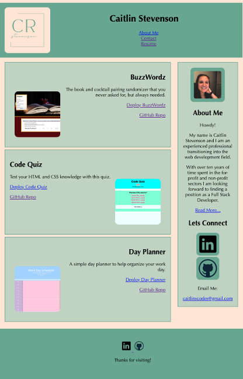

# Caitlin Stevenson|Updated Portfolio Assignment

## Objectives

In this project, I made several updates to my portfolio including adding several of my completed projects as samples, updating my contact information, and linking a pdf of my resume. I also made updates to my GitHub profile like creating a bio, adding a form of contact, and pinning several of my projects to my profile page. Finally, I made some updates to my Linkedin profile to reflect my active engagement in this bootcamp.

## Screenshot of Final Page

## Link To The Final Page

[Link to final webpage](https://caitlinscodes.github.io/updated_portfolio/)

## License

This code is licensed under the MIT License.